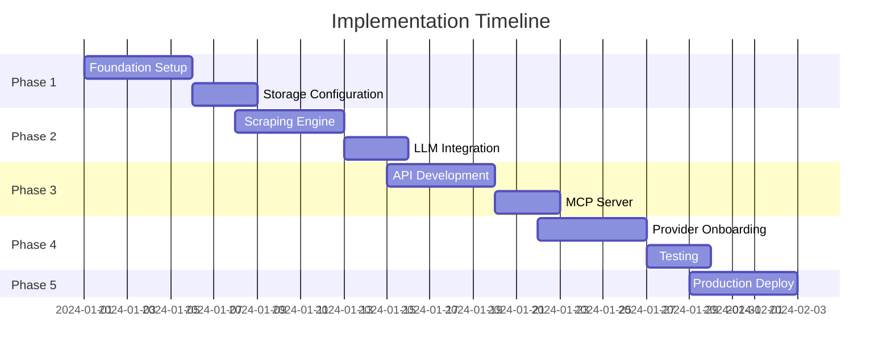

# Chapter 4: Implementation Plan

## 4.1 Development Roadmap

### 5-Week Implementation Schedule



## 4.2 Phase 1: Foundation (Week 1)

### Day 1-2: Project Setup
```bash
# Initialize project
npm init
npm install hono @hono/zod-openapi @scalar/hono-api-reference
npm install @cloudflare/playwright zod openai
npm install -D wrangler @cloudflare/workers-types

# Project structure
mkdir -p src/{api,scraping,validation,storage,providers}
mkdir -p architecture tests scripts
```

### Day 3: Cloudflare Configuration
```toml
# wrangler.toml
name = "cloud-pricing-api"
main = "src/index.ts"
compatibility_date = "2024-01-15"
node_compat = true

[env.production]
kv_namespaces = [
  { binding = "PRICING_DATA", id = "xxx" }
]

[[r2_buckets]]
binding = "ARCHIVE"
bucket_name = "pricing-archive"

[browser]
binding = "BROWSER"
```

### Day 4-5: Core Interfaces
```typescript
// src/types/index.ts
export interface PricingData {
  provider: string;
  scrapedAt: string;
  sources: Source[];
  data: any;
  metadata: Metadata;
}

export interface ProviderConfig {
  id: string;
  name: string;
  urls: string[];
  category: string;
}

// src/config/providers.ts
export const PROVIDERS: ProviderConfig[] = [
  {
    id: "vercel",
    name: "Vercel",
    urls: [
      "https://vercel.com/pricing",
      "https://vercel.com/docs/limits"
    ],
    category: "hosting"
  }
  // Add more providers
];
```

## 4.3 Phase 2: Scraping & Extraction (Week 2)

### Day 6-7: Universal Scraper
```typescript
// src/scraping/universal-scraper.ts
import { launch } from '@cloudflare/playwright';

export class UniversalScraper {
  constructor(private env: Env) {}
  
  async scrapeProvider(providerId: string): Promise<ScrapingResult> {
    const browser = await launch(this.env.BROWSER);
    const config = PROVIDERS.find(p => p.id === providerId);
    
    try {
      const pages = await this.scrapeAllPages(browser, config.urls);
      const screenshots = await this.captureScreenshots(pages);
      await this.storeRawData(providerId, pages, screenshots);
      
      return { success: true, pages };
    } finally {
      await browser.close();
    }
  }
  
  private async scrapeAllPages(
    browser: Browser, 
    urls: string[]
  ): Promise<PageData[]> {
    return Promise.all(urls.map(url => this.scrapePage(browser, url)));
  }
}
```

### Day 8-9: LLM Integration
```typescript
// src/extraction/llm-extractor.ts
import OpenAI from 'openai';

export class LLMExtractor {
  private openai: OpenAI;
  
  constructor(apiKey: string) {
    this.openai = new OpenAI({ apiKey });
  }
  
  async extract(
    provider: string, 
    pages: PageData[]
  ): Promise<any> {
    const prompt = this.buildPrompt(provider, pages);
    
    const completion = await this.openai.chat.completions.create({
      model: "gpt-4-turbo",
      messages: [
        { role: "system", content: EXTRACTION_SYSTEM_PROMPT },
        { role: "user", content: prompt }
      ],
      temperature: 0.1,
      response_format: { type: "json_object" }
    });
    
    return JSON.parse(completion.choices[0].message.content);
  }
}
```

### Day 10: Validation Pipeline
```typescript
// src/validation/pipeline.ts
export class ValidationPipeline {
  async validate(provider: string, data: any): Promise<ValidationResult> {
    // 1. Core validation
    const coreValid = this.validateCore(data);
    if (!coreValid) return { valid: false, reason: 'core' };
    
    // 2. Provider rules
    const rulesValid = await this.validateRules(provider, data);
    
    // 3. LLM validation
    const semanticValid = await this.validateWithLLM(provider, data);
    
    // 4. Statistical validation
    const statsValid = await this.validateStatistically(provider, data);
    
    const confidence = this.calculateConfidence({
      core: coreValid,
      rules: rulesValid,
      semantic: semanticValid,
      statistical: statsValid
    });
    
    return {
      valid: confidence > 0.7,
      confidence,
      data
    };
  }
}
```

## 4.4 Phase 3: API Development (Week 3)

### Day 11-12: REST API
```typescript
// src/api/index.ts
import { OpenAPIHono } from '@hono/zod-openapi';
import { routes } from './routes';

export function createApp(env: Env) {
  const app = new OpenAPIHono<{ Bindings: Env }>();
  
  // Middleware
  app.use('*', cors());
  app.use('*', versionMiddleware());
  app.use('*', cacheMiddleware());
  
  // Register routes
  routes.forEach(route => app.openapi(route.spec, route.handler));
  
  // OpenAPI docs
  app.doc('/openapi.json', {
    openapi: '3.1.0',
    info: {
      title: 'Cloud Pricing API',
      version: '2024-01-15'
    }
  });
  
  // Scalar UI
  app.get('/docs', apiReference({
    spec: { url: '/openapi.json' }
  }));
  
  return app;
}
```

### Day 13: MCP Server
```typescript
// src/mcp/server.ts
import { McpServer } from "@modelcontextprotocol/sdk/server/index.js";

export function createMCPServer(env: Env) {
  const server = new McpServer({
    name: "cloud-pricing",
    version: "1.0.0"
  });
  
  // Register tools
  server.registerTool("get_provider", ...);
  server.registerTool("compare", ...);
  server.registerTool("search", ...);
  
  // Register resources
  server.registerResource("providers", ...);
  
  return server;
}
```

### Day 14-15: Client SDKs
```typescript
// packages/sdk/src/index.ts
export class CloudPricingClient {
  constructor(private config: ClientConfig) {}
  
  async getProvider(id: string): Promise<PricingData> {
    const response = await fetch(
      `${this.config.baseUrl}/providers/${id}`,
      {
        headers: {
          'API-Version': this.config.apiVersion,
          'Authorization': `Bearer ${this.config.apiKey}`
        }
      }
    );
    
    if (!response.ok) {
      throw new APIError(response);
    }
    
    return response.json();
  }
}
```

## 4.5 Phase 4: Provider Onboarding (Week 4)

### Day 16-17: Initial Providers
```typescript
// scripts/add-provider.ts
async function addProvider(config: ProviderConfig) {
  // 1. Add to registry
  PROVIDERS.push(config);
  
  // 2. Test scraping
  const scraper = new UniversalScraper(env);
  const result = await scraper.scrapeProvider(config.id);
  
  if (!result.success) {
    throw new Error(`Failed to scrape ${config.id}`);
  }
  
  // 3. Test extraction
  const extractor = new LLMExtractor(env.OPENAI_KEY);
  const data = await extractor.extract(config.id, result.pages);
  
  // 4. Validate
  const validator = new ValidationPipeline(env);
  const valid = await validator.validate(config.id, data);
  
  if (!valid.valid) {
    console.warn(`Validation issues for ${config.id}:`, valid);
  }
  
  // 5. Store
  await env.KV.put(
    `pricing:${config.id}:current`,
    JSON.stringify(data)
  );
  
  console.log(`✅ Added provider: ${config.id}`);
}

// Add initial set
const initialProviders = [
  'vercel', 'netlify', 'cloudflare',
  'aws', 'gcp', 'azure',
  'openai', 'anthropic', 'stripe'
];

for (const provider of initialProviders) {
  await addProvider(getProviderConfig(provider));
}
```

### Day 18-19: Testing Suite
```typescript
// tests/integration/api.test.ts
describe('API Integration Tests', () => {
  test('Provider endpoint', async () => {
    const response = await api.get('/providers/vercel');
    
    expect(response.status).toBe(200);
    expect(response.body).toHaveProperty('provider', 'vercel');
    expect(response.body).toHaveProperty('pricing.raw');
  });
  
  test('Version compatibility', async () => {
    const v1 = await api.get('/providers/vercel', {
      headers: { 'API-Version': '2024-01-15' }
    });
    
    const v2 = await api.get('/providers/vercel', {
      headers: { 'API-Version': '2024-06-15' }
    });
    
    // V1 structure preserved in V2
    expect(v2.body).toMatchObject(v1.body);
  });
});

// tests/validation/pipeline.test.ts
describe('Validation Pipeline', () => {
  test('Accepts valid data', async () => {
    const valid = await pipeline.validate('vercel', validData);
    expect(valid.valid).toBe(true);
    expect(valid.confidence).toBeGreaterThan(0.7);
  });
  
  test('Rejects invalid data', async () => {
    const invalid = await pipeline.validate('vercel', {});
    expect(invalid.valid).toBe(false);
  });
});
```

### Day 20: Monitoring Setup
```typescript
// src/monitoring/index.ts
export class Monitor {
  async trackScraping(provider: string, result: any) {
    await this.env.ANALYTICS.writeDataPoint({
      event: 'scraping',
      provider,
      success: result.success,
      duration: result.duration,
      confidence: result.confidence
    });
  }
  
  async checkHealth(): Promise<HealthStatus> {
    const providers = await this.getAllProviders();
    const stale = providers.filter(p => this.isStale(p));
    
    return {
      healthy: stale.length === 0,
      providers: {
        total: providers.length,
        stale: stale.length
      }
    };
  }
}
```

## 4.6 Phase 5: Production Deployment (Week 5)

### Day 21-22: Performance Optimization
```typescript
// Optimize scraping concurrency
class OptimizedScraper {
  async scrapeAll() {
    const providers = await this.getProviders();
    
    // Batch for resource limits
    const batches = chunk(providers, 5);
    
    for (const batch of batches) {
      await Promise.all(
        batch.map(p => this.scrapeWithRetry(p))
      );
    }
  }
  
  private async scrapeWithRetry(provider: string, retries = 3) {
    for (let i = 0; i < retries; i++) {
      try {
        return await this.scrape(provider);
      } catch (error) {
        if (i === retries - 1) throw error;
        await sleep(Math.pow(2, i) * 1000);
      }
    }
  }
}
```

### Day 23: Security Audit
```bash
# Security checklist
- [ ] API keys properly secured
- [ ] Rate limiting configured
- [ ] CORS properly set
- [ ] Input validation on all endpoints
- [ ] No sensitive data in logs
- [ ] Proper error messages (no stack traces)
```

### Day 24: Load Testing
```typescript
// scripts/load-test.ts
import { check } from 'k6';
import http from 'k6/http';

export const options = {
  stages: [
    { duration: '2m', target: 100 },
    { duration: '5m', target: 100 },
    { duration: '2m', target: 0 },
  ],
};

export default function() {
  const response = http.get('https://api.cloudpricing.dev/providers/vercel');
  
  check(response, {
    'status is 200': (r) => r.status === 200,
    'response time < 200ms': (r) => r.timings.duration < 200,
    'has pricing data': (r) => JSON.parse(r.body).pricing !== undefined,
  });
}
```

### Day 25: Deployment
```bash
# Deploy to production
wrangler deploy --env production

# Verify deployment
curl https://api.cloudpricing.dev/health

# Run smoke tests
npm run test:production

# Enable monitoring
wrangler tail --env production
```

## 4.7 Provider Onboarding Guide

### Adding a New Provider
```typescript
// 1. Create provider configuration
const newProvider: ProviderConfig = {
  id: "digitalocean",
  name: "DigitalOcean",
  urls: [
    "https://www.digitalocean.com/pricing",
    "https://docs.digitalocean.com/products/platform/limits"
  ],
  category: "cloud"
};

// 2. Add to registry
PROVIDERS.push(newProvider);

// 3. Test scraping
npm run test:provider digitalocean

// 4. Deploy
npm run deploy
```

### Provider Checklist
```markdown
## New Provider Checklist

- [ ] Provider config created
- [ ] URLs identified (pricing, limits, docs)
- [ ] Test scraping successful
- [ ] LLM extraction working
- [ ] Validation passing
- [ ] Data stored in KV
- [ ] API endpoint working
- [ ] SDK updated
- [ ] Documentation updated
```

## 4.8 Testing Strategy

### Test Pyramid
```
         /\
        /  \  E2E Tests (10%)
       /    \  - Full flow tests
      /------\
     /        \ Integration Tests (30%)
    /          \ - API tests, Scraping tests
   /------------\
  /              \ Unit Tests (60%)
 /                \ - Validators, Transformers, Utils
/------------------\
```

### Test Coverage Goals
- Unit Tests: 80% coverage
- Integration Tests: Critical paths
- E2E Tests: Happy path + key edge cases

## 4.9 Documentation

### API Documentation
```markdown
# API Documentation

## Authentication
All write operations require an API key:
```
Authorization: Bearer YOUR_API_KEY
```

## Versioning
Specify version via header:
```
API-Version: 2024-01-15
```

## Endpoints

### GET /providers
List all available providers...

### GET /providers/{id}
Get pricing data for a specific provider...
```

### Developer Guide
```markdown
# Developer Guide

## Local Development
1. Clone repository
2. Install dependencies: `npm install`
3. Copy `.env.example` to `.env`
4. Run locally: `npm run dev`

## Adding Providers
See [Provider Onboarding Guide](#provider-onboarding)

## Deployment
Automatic deployment on push to main branch
```

## 4.10 Maintenance Plan

### Daily Tasks
- Monitor scraping success rate
- Check for failed validations
- Review extraction confidence scores

### Weekly Tasks
- Add new providers
- Update provider configurations
- Review API usage patterns

### Monthly Tasks
- Performance optimization
- Security updates
- SDK releases

## 4.11 Success Metrics

### Launch Criteria
- [ ] 10+ providers successfully scraping
- [ ] API response time < 200ms (P95)
- [ ] 99.9% uptime
- [ ] Zero breaking changes
- [ ] Documentation complete

### Growth Metrics
- Week 1: 10 providers
- Month 1: 20 providers
- Month 3: 30+ providers
- Month 6: 50+ providers

## 4.12 Risk Mitigation

### Technical Risks
| Risk | Mitigation |
|------|------------|
| Website structure changes | LLM adaptation + monitoring |
| Rate limiting by providers | Caching + respectful scraping |
| LLM extraction errors | Multi-layer validation |
| API breaking changes | Date-based versioning |

### Business Risks
| Risk | Mitigation |
|------|------------|
| Provider blocks scraping | Manual data entry fallback |
| Inaccurate data | Human review queue |
| Scaling issues | Cloudflare auto-scaling |

## Conclusion

This implementation plan provides a clear path from zero to production-ready API in 5 weeks. The modular architecture allows for continuous improvement and easy provider additions without disrupting existing functionality.

### Key Success Factors
1. **Flexible architecture** - Handles any provider
2. **Robust validation** - Ensures data quality
3. **Stable API** - Never breaks clients
4. **Easy scaling** - Add providers in minutes
5. **Comprehensive testing** - Confidence in changes

### Next Steps
1. Set up development environment
2. Begin Phase 1 implementation
3. Onboard first 3 providers
4. Deploy to staging
5. Gather feedback and iterate